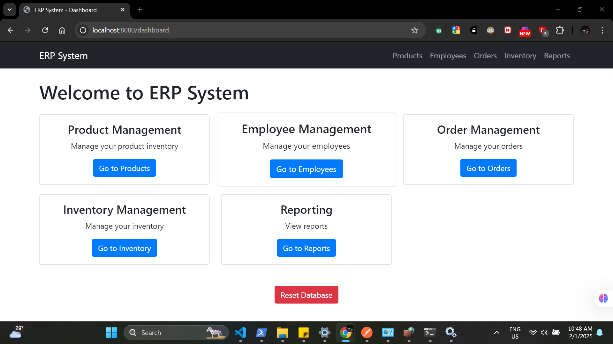

# ERP System

Enterprise Resource Planning System built with Spring Boot and Oracle Database.

## Features

- Employee Management
- Product Management
- Order Management
- Inventory Management
- Reporting
- REST API endpoints
- Oracle Database integration
- Spring Security implementation

## Setup

1. Install Java 11 or higher
2. Install Maven
3. Install Oracle Database
4. Configure `application.properties` with your database credentials
5. Run `mvn clean install`
6. Start the application with `java -jar target/erp-system-1.0.0.jar`

## Resetting the Database

To reset the database and clear all management data, you can use the reset endpoint:

1. Navigate to the dashboard.
2. Click the "Reset Database" button.
3. Confirm the action.

## API Endpoints

- GET /api/employees - Retrieve all employees
- POST /api/employees - Create new employee
- GET /api/products - Retrieve all products
- POST /api/products - Create new product
- GET /api/orders - Retrieve all orders
- POST /api/orders - Create new order
- GET /api/inventory - Retrieve all inventory items
- POST /api/inventory - Create new inventory item

## Technologies Used

- Spring Boot
- Spring Data JPA
- Spring Security
- Thymeleaf
- Oracle Database
- Flyway
- Maven
- Bootstrap

## Screenshots

